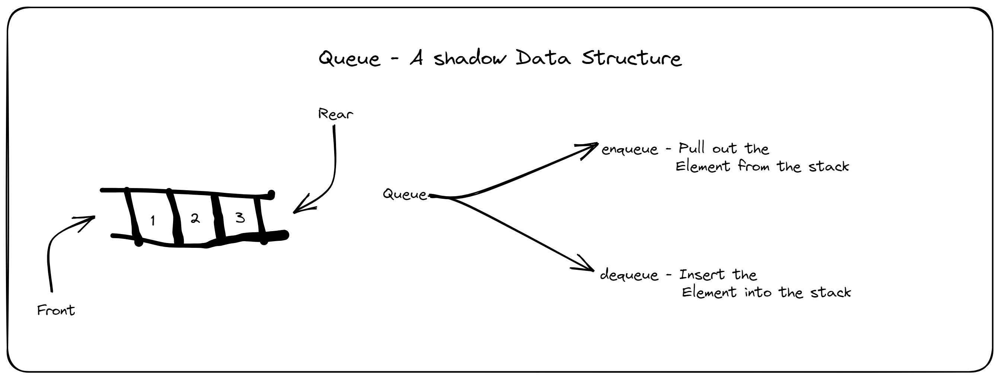

# BYTS Day 4 Notes

## Classification of Data Structure

Data Structure can be classified into two types:

- Linear Data Structure
- Non Linear Data Structure

## Stack

- Stack is a LIFO (Last In First Out) Data Structure.
- Stack has Position called top, where insertion and deletion done (Done in one way).

- OverFlow - Trying to push element over the Limit of stack.

- UnderFlow - Trying to Pop element from the empty stack.

### Assigment

1. Disavdantage of stack in unorganized data
1. Is Stack data structure Perment?
1. Can I create a Stack dynamically? If so how?
1. Is FILO is same as LIFO?
1. How stack are used in Operating System?

#### Stack Implementation

Code for Stack Implementation can be found [Here](./stack.c).

## Queue

- Queue is a FIFO.
- Queue has two part Front and Rear.
- Front == Rear then the Queue is empty.
- Enqueue -> adding the items to the Queue.
- Dequeue -> deleting the items from the Queue.
- Time Complicity of insertion and deletion is O(1).

### Assigment

1. Time complicity of adding and deleting a element from queue ?
1. what is the time for the element arriving ?
1. How many stack required to create a queue ?

## Sorting

Sorting is a process of arranging the elements in a array.

There are five types of sorting:

- insertion sort
- selection sort
- bubble sort
- merge sort
- quick sort

### Insertion Sort

    The numbers are arranged in the order by creating a slot between the elements and elements in the array. There are 2 parts in this type of sorting.one is the sorted part and the other is the unsorted part. The elements from the unsorted part are inserted into the sorted part by creating an empty slot.

### Selection Sort

    The minimum value is selected first from the given order and compared with the maximum value on the left side of the elements present in the array.comparasion happens in 2 unsorted data elements.

### Bubble Sort

    The contigous elements are selected and sorted in an ascending order. The pair of elements are selection continue till the end of the array until the array is sorted.

### Merge Sort

    This adopts the divide and conquer approach. The array is divided into two parts and the sorting is done in the two parts.after sorting the two parts are merged to form a sorted array.

## Time complicities of the sorting algorithms

- insertion sort - best case O(n) worst case O(n^2) average case O(n^2)
- selection sort - best case O(n^2) worst case O(n^2) average case O(n^2)
- bubble sort - best case O(n) worst case O(n^2) average case O(n^2)
- merge sort - best case O(nlogn) worst case O(nlogn) average case O(nlogn)
- quick sort - best case O(nlogn) worst case O(n^2) average case O(nlogn)

## space complexity of the sorting algorithms

- insertion sort - O(1)
- selection sort - O(1)
- bubble sort - O(1)
- merge sort - O(n)
- quick sort - O(logn)
