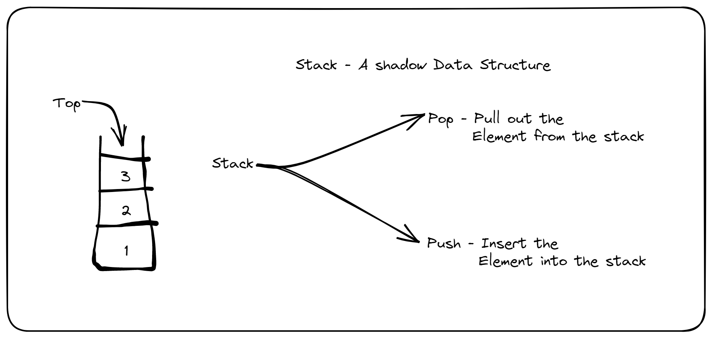

# BYTS Day 4 Notes

## Classification of Data Structure

Data Structure can be classified into two types:

- Linear Data Structure
- Non Linear Data Structure

## Stack

- Stack is a LIFO (Last In First Out) Data Structure.
- Stack has Position called top, where insertion and deletion done (Done in one way).

- OverFlow - Trying to push element over the Limit of stack.

- UnderFlow - Trying to Pop element from the empty stack.

### Assigment

1. Disavdantage of stack in unorganized data
1. Is Stack data structure Perment?
1. Can I create a Stack dynamically? If so how?
1. Is FILO is same as LIFO?
1. How stack are used in Operating System?

### Stack Implementation
